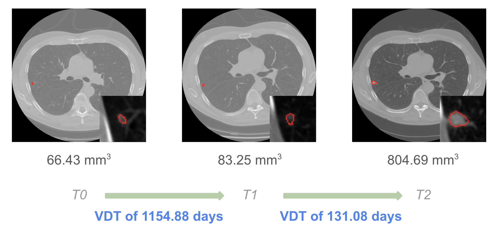
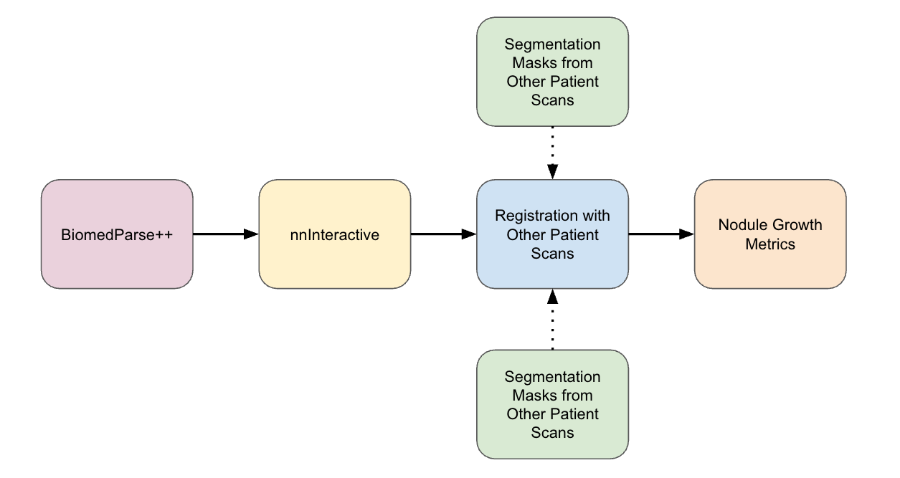

# nodule_volumes

## Overview

**`nodule_volumes`** is an open-source framework for automatic segmentation and tracking of lung nodules across longitudinal CT scans. It integrates state-of-the-art detection models with 3D segmentation and registration techniques in order to assess lung nodule growth over time. We developed and evaluated this framework as part of the MEng thesis entitled [**"Towards Fully Automated Volumetric Analysis of Lung Nodules in Computed Tomography"**](mit.edu) (May 2025) by Evan Rubel.

<p align="center">
   
</p>

---

## Highlights

- ✅ Supports **multi-format inputs**: NIFTI, DICOM, and structured CSV
- 🧠 Plug-and-play with pretrained models like **[BiomedParse](https://github.com/microsoft/BiomedParse)** and **[TotalSegmentator](https://github.com/wasserth/TotalSegmentator)**
- 🎯 False-positive suppression with **lung and lung vessel masks**
- 🧹 Smooth 3D segmentations via **[nnInteractive](https://github.com/MIC-DKFZ/nnInteractive)** refinement
- ♻️ Full pipeline includes nodule segmentation, scan registration, and nodule volume extraction
- 📁 Clean data structure for seamless dataset management and result caching
- 🔬 Built with real-world CT data in mind (e.g., NLST)

---

## Table of Contents

- [Installation](#installation)
- [Data Setup](#setting-up-the-data)
- [Configuration](#configuration)
- [Execution](#execution)
- [Directory Structure](#output-structure)
- [Development Notes](#development-notes)
- [Attribution](#attribution)

---

## Installation

1. Clone this repository:
   ```bash
   git clone git@github.com:evanrubel/nodule_volumes.git
   ```

2. Clone the detection model (BiomedParse) into place:
   ```bash
   cd src/segment/models
   git clone git@github.com:evanrubel/BiomedParse.git
   ```

3. Set up environments:
   - `biomedparse` per the [BiomedParse installation guide](https://github.com/microsoft/BiomedParse?tab=readme-ov-file#installation)
   - `nnInteractive`:
     ```bash
     conda create -n nnInteractive python=3.10 -y
     conda activate nnInteractive
     pip install nninteractive
     ```

---

## Setting Up the Data

Create a dataset directory:
```bash
mkdir nodule_volumes/data/my_dataset
```

Each dataset should include:

```text
my_dataset/
├── images/        # Input NIFTI or DICOM scans
├── config.json    # Configuration file (see below)
```

### Supported input formats (mix-and-match allowed):

1. NIFTI file ending in `_0000.nii.gz` (RAS orientation)
2. Directory of DICOM slices (named with the scan ID)
3. CSV with:
   - `pid`
   - `Series_0`, `Series_1`, `Series_2` → Directories for longitudinal scans

**Naming Convention**: Include `T0`, `T1`, or `T2` in the scan ID (e.g., `nlst_123456T1_0000.nii.gz`)

---

## Configuration

For example, the `config.json` can look like:

```json
{
  "device": 0,
  "detection_model": "biomedparse++",
  "lung_mask_mode": "mask",
  "lung_vessel_overlap_threshold": null,
  "p_f_threshold": 0.2,
  "prompt_type": "mask",
  "prompt_subset_type": "all"
}
```

### Key Options:

- `device`: CUDA device (integer)
- `detection_model`: Choose between `biomedparse`, `biomedparse++`, or `total_segmentator`
- `lung_mask_mode`:
  - `"mask"`: excludes detections outside lung region
  - `"range"`: limits by z-slice range
  - `null`: no masking
- `lung_vessel_overlap_threshold`: filter based on vessel overlap (a floating point value between 0 and 1, inclusive)
- `p_f_threshold`: increases model confidence threshold (BiomedParse++ only)
- `prompt_type`: how nnInteractive is guided (`mask`, `bbox`, or `pos_point`)
- `prompt_subset_type`: which prompts to use (`all`, `maximum`, or `median`)

---

## Execution

Run the full pipeline (segmentation + registration):

```bash
cd src
python nodule_volumes.py -t full -d my_dataset --v
```

Other tasks:
- `-t segment`: segmentation only
- `-t register`: registration only

### System Diagram

<p align="center">
   
</p>

---

## Output Structure

After running, outputs are saved under the corresponding dataset folder:

```text
my_dataset/
├── lung_masks/               # [Optional] lung segmentation masks
├── lung_vessel_masks/        # [Optional] vessel masks
├── results/
│   └── <timestamp>/
│       ├── *_initial.nii.gz  # Raw segmentation outputs
│       ├── *_final.nii.gz    # Refined segmentations
│       ├── *_registered.nii.gz
│       └── volumes.json      # Tracked nodule volumes across time
└── transforms/               # Cached transforms for registration
```

---

## Development Notes

- See synced fork of [BiomedParse](https://github.com/evanrubel/BiomedParse) at `src/segment/models/BiomedParse`
- Full project design and notes in [this document](https://docs.google.com/document/d/1My76WuBxeqBuQXIBevDKrWPAox0fJdXXWl1wikzfgds/edit?usp=sharing)
- TODOs:
  - [ ] Freeze Conda environment for reproducibility
  - [ ] Change CSV to JSON with full DICOM paths for batch processing

---

## Attribution

This project was developed by [Evan Rubel](https://github.com/evanrubel) as part of a broader research initiative to improve our understanding of lung nodule growth.

It integrates multiple third-party models under appropriate licenses. We thank [Professor Regina Barzilay](https://www.rbg.mit.edu/) and her research group for their support of this project.
